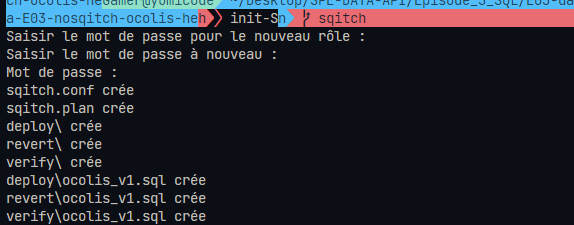

# SQITCH 

## Step by step

### 1. Initialization

Create a file init.sh to start the project

```sh
# Create user in DB
createuser -l -W ocolis 

# Create DB
createdb -O ocolis ocolis

# Initialize Sqitch with postgres
sqitch init ocolis --uri https://github.com/helene-nguyen/sqitch-use --engine pg

# Starter commit change
sqitch add ocolis_v1 -n 'First version'
```
Source [Postgres](https://docs.postgresql.fr/10/app-createuser.html)

Launch the file in bash

```sh
sh ./init.sh
```

Or create an alias in .bashrc

Once init, you can #checkSQITCH if everything is ok and if you well have your init

```sh
sqitch plan -f short --no-headers
```

Result 



Custom message commit

```sh
sqitch plan -f format:'Title of commits Sqitch '%v%{date}p' 
'%s
```

```sh
# Project: ocolis
# File:    sqitch.plan

Title of commits Sqitch
2022-06-11 08:52:24 +0200 First version
```

### 2. Deployment Version 1

`deploy` : Create tables
`revert` : Drop tables
`verify` : Check if ok

###
###
###
###
###
###
###
###
###
###
###
###