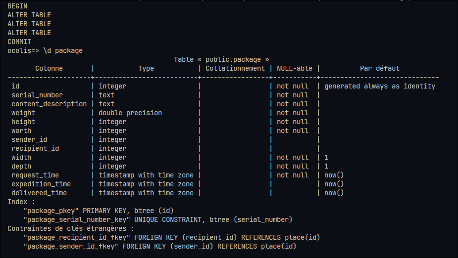

# O'colis

## Version 1

## Version 2

Changement du type de la colonne "serial_number" en champ texte

## Version 3

Rendre la colonne "serial_number" UNIQUE

## Version 4

Modifier une colonne et ajouter 2 colonnes 

## Version 5

Ajout des colonnes pour récupérer les dates

